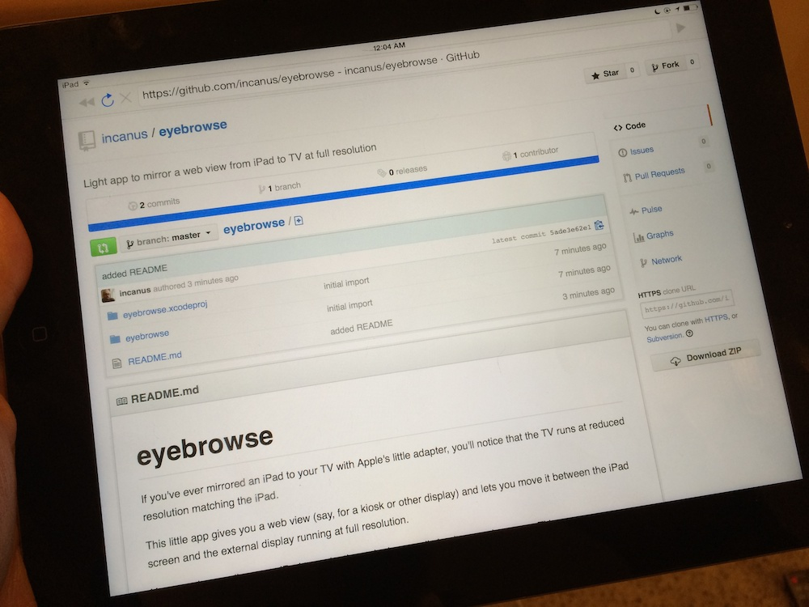
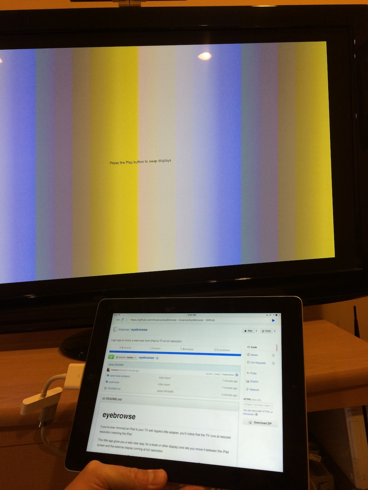
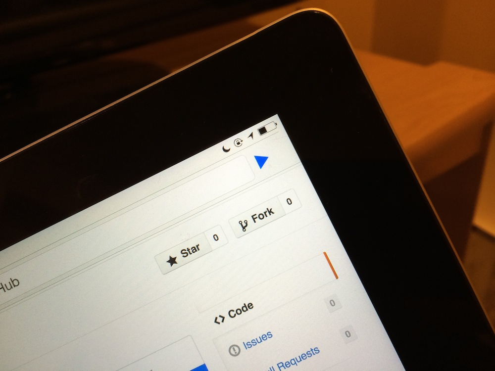
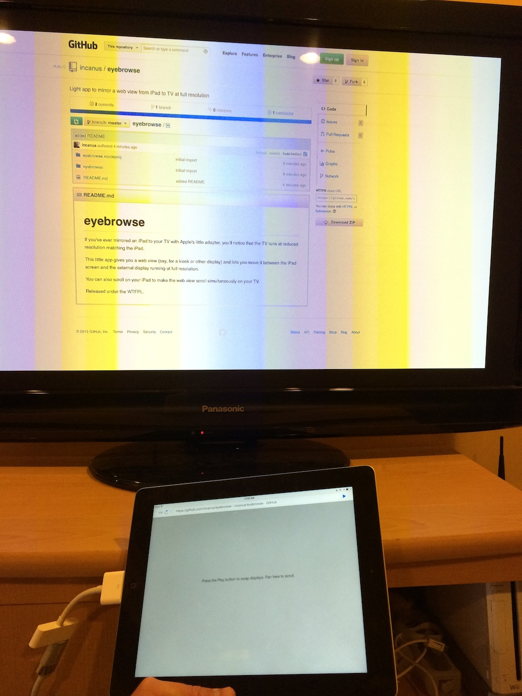
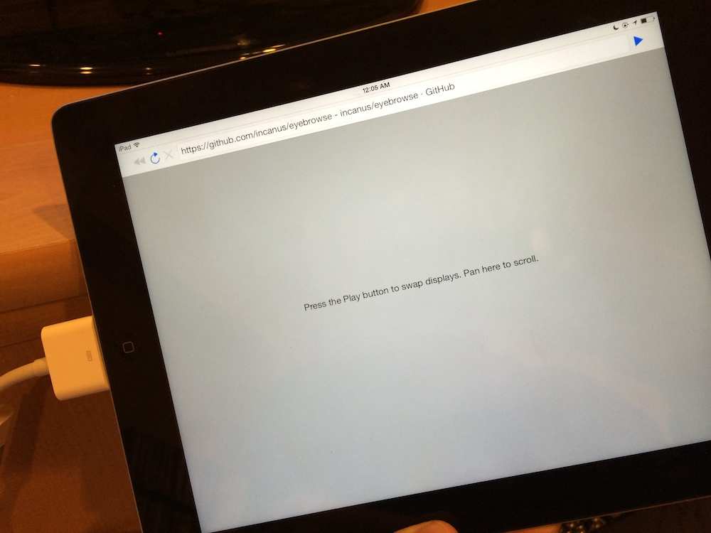

# eyebrowse

If you've ever mirrored an iPad to your TV with Apple's little adapter, you'll notice that the TV runs at reduced resolution matching the iPad. 

This little app gives you a web view (say, for a kiosk or other display) and lets you move it between the iPad screen and the external display running at full resolution. 

You can also scroll on your iPad to make the web view scroll simultaneously on your TV. 

Released under the [WTFPL](http://www.wtfpl.net). 

*Load up a web page*

*Your TV shows an empty screen*

*Press the Play button*

*The ol' Switcheroo*

*iPad becomes a controller*